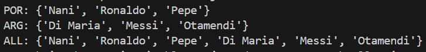
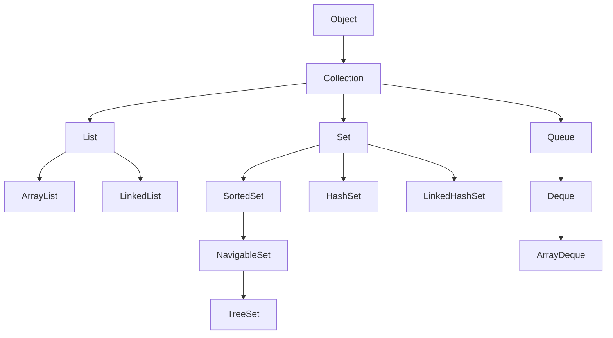

# public Class **Collections** extends Objects

* The **Collections** class is a utility class in Java that provides static methods for operating on collections (like lists, sets, etc.).
* It contains methods for searching, sorting, and manipulating collections.
* The **Collections** class cannot be instantiated, as it has a private constructor.
* It is part of the Java Collections Framework, which provides a set of classes and interfaces for working with groups of objects.
* The methods in this class throw **NullPointerException** if the collection provided is null.
* It contains polymorphic algorithms that operate on collections such as `sort` (sorting), `binarySearch` (searching), `shuffle` (randomizing the order of elements), and `reverse` (reversing the order of elements).
* **UnsupportedOperationException** is thrown by certain methods to indicate that the requested operation is not supported.

## Fields

* ### public static final List **EMPTY_LIST**

  * Represents an empty, immutable list.

* ### public static final Set **EMPTY_SET**

  * Represents an empty, immutable set.

* ### public static final Map **EMPTY_MAP**

  * Represents an empty, immutable map.

## Methods

* ### public static &lt;T&gt; boolean **addAll(Collection&lt;? super T&gt; c, T... elements)**

  * Adds all specified elements to the specified collection.
  * Returns true if the collection changed as a result of the call.
  
  * #### Sample Code

    ```Java
    ArrayList<String> teamAPlayers = new ArrayList<>();
    ArrayList<String> teamBPlayers = new ArrayList<>();
    ArrayList<String> players = new ArrayList<>();
    Collections.addAll(teamAPlayers, "Nani", "Ronaldo", "Pepe");
    Collections.addAll(teamBPlayers, "Di Maria", "Messi", "Otamendi");
        
    players.addAll(teamAPlayers);
    players.addAll(teamBPlayers);
    System.out.println("POR: {\'" + String.join("\', \'", teamAPlayers) + "\'}");
    System.out.println("ARG: {\'" + String.join("\', \'", teamBPlayers) + "\'}");
    System.out.println("ALL: {\'" + String.join("\', \'", players) + "\'}");
    ```

  * #### Output

    
  
## Hierarchy


