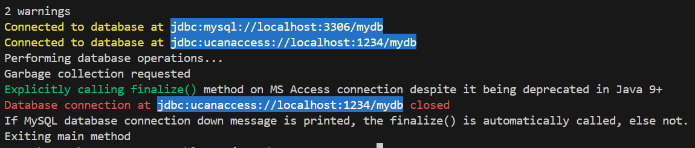

# Class **Object**

* Every class extends the root **Object** class, hence, all objects including arrays implement its methods.

## Constructors

* ### Object()

    ```Java
    Object sampleObject = new Object();
    System.out.println("toString(): " + sampleObject);
    /*
    ** toString(): <complete class name>@<memory reference>
    ** e.g.,
    ** => toString(): java.lang.Object@37574691
    */
    ```

## Methods

* ### *protected Object* clone() *throws CloneNotSupportedException*

    Since it is a protected method, to use it an essential criteria is to implement the *Cloneable* interface which is done by most java.util classes.

    ```Java
    ArrayList firstObject = new ArrayList<Integer>();
    firstObject.add(1);
    firstObject.add(2);

    ArrayList secondObject = (ArrayList) firstObject.clone();
    // Note: it will be shallow, not a deep copy.

    System.out.println(
     "first: " + firstObject
     + "second: " + secondObject
     + "first == second: " + (firstObject == secondObject)
     + "first.equals(second): " + firstObject.equals(secondObject)
    );
    ```

    [Do check the source code for Shallow and Deep copy.](./CloneExample.java)

* ### *String* toString()

    It represents an object textually, and it should be overriden for every subclasses.

    For the root *Object* class, it returns the class name ( *getClass().getName()* ) followed by ampersand ( *@* ) before the integer hexadecimal representation of the object hashcode ( *Integer.toHexString(hashCode())* ).

    ```Java
    Object object = new Object();
    System.out.printf(
      "%-20s: %s\n"
      +"%-20s: %s\n"
      +"%-20s: %s\n"
      +"%-20s: %s\n"
      +"%-20s: %s\n",
      "object",
      object,
      "object.toString()",
      object.toString(),
      "object.getClass()",
      object.getClass(),
      "object.hashCode()",
      object.hashCode(),
      "Integer.toHexString(object.hashCode()): ",
      Integer.toHexString(object.hashCode())
    );
    ```

    

> [!NOTE]
> [Read more about ***String*** here, especially this note](../String/README.md#important-note-what-class-to-use-and-when)

* ### *public boolean* equals(Object obj)

    It compares two objects to verify they are equal. This method can be overriden to define custom criteria for equality, however, hashcode() should be overriden too, because two objects with same hashcode are generally considered equal/same.

    

    [Check the source code here.](./OverridenEqualsExample.java)

* ### *protected void* finalize() *throws Throwable*

    It has been deprecated since v9+, though, its purpose was to do finalization, or to free resources before garbage collection starts.

    Due to the following major reasons, it is deprecated:

    * **Unpredictable latency** — An arbitrarily long time may pass between the moment an object becomes unreachable and the moment its finalizer is called. In fact, the GC provides no guarantee that any finalizer will ever be called.

    * **Unconstrained behavior** — Finalizer code can take any action. In particular, it can save a reference to the object being finalized, thereby resurrecting the object and making it reachable once again.

    * **Always enabled** — Finalization has no explicit registration mechanism. A class with a finalizer enables finalization for every instance of the class, whether needed or not. Finalization of an object cannot be cancelled, even if it is no longer necessary for that object.

    * **Unspecified threading** — Finalizers run on unspecified threads, in an arbitrary order. Neither threading nor ordering can be controlled.

    For detailed information, [read this JDK Enhancement Proposal (JEP)](https://openjdk.org/jeps/421).

    Below is a sample program output that shows the *finalize()* method never got called. [Check the source code here.](./OverridenFinalizeExample.java)

    

> [!TIP]
>
> * Either use *try-with-resources* statement introduced in **Java 7** which guarantees the resources will be released regardless of exceptions unlike conventional *try-finally* blocks where an exception in *finally* block can leak memory.
>
>   ```Java
>   try (FileInputStream input = new FileInputStream(file1);
>        FileOutputStream output = new FileOutputStream(file2)) {
>       ... copy bytes from input to output ...
>    ```
>
> * Or use cleaner API introduced in **Java v9** which registers a cleaning action to be run when the object becomes unreachable. Cleaning actions avoid many of the drawbacks of finalizers:
>
>   * **No object resurrection** — Cleaning actions cannot access the object, so object resurrection is impossible.
>   * **Enabled on-demand** — A constructor can register a cleaning action for a new object after the object is fully initialized. This means that a cleaning action never processes an uninitialized or partially initialized object. In addition, a program can cancel an object's cleaning action so that the GC no longer needs to schedule the action.
>   * **No interference** — The developer can control which threads run cleaning actions, and so can prevent interference between cleaning actions. In addition, an erroneous or malicious subclass cannot interfere with cleaning actions set up by its superclass.

> [!CAUTION]
> Like finalizers, cleaning actions are scheduled by the GC, so they may suffer from unbounded delays. Thus the *cleaner API* ***should not be used in situations where the timely release of a resource is required.***

> [!IMPORTANT]
> Cleaners should not be used to replace a finalizer that serves only as a safety net to protect against uncaught exceptions or missing calls of close() methods; in such cases, investigate using try-with-resources before converting the finalizer to a cleaner.

* ### *public final void* wait() *throws InterruptedException, IllegalMonitorStateException*

    It causes the current thread of the object to wait until another thread notifies the object using *notify()* or *notifyAll()*.

    Exceptions throwable by this method:

    * ***IllegalMonitorStateException*** - if the current thread is not the owner of the object's monitor.

    * ***InterruptedException*** - if any thread interrupted the current thread before or while the current thread was waiting for a notification.

    [Check this sample program for wait() and notify()](./WaitAndNotifyExample.java)

> [!NOTE]
> This method should always be used in a loop as in the one argument version, interrupts and spurious wakeups are possible.
>
>```Java
>...
>synchronized(sharedObject) {
>    while (condition) {
>       sharedObject.wait();
>       // perform appropriate actions
>   }
>}
>```

* ### *public final void* notify() *throws IllegalMonitorStateException*

    It awakens a single waiting thread for an object's monitor. If many threads are waiting on this object, one of them is chosen arbitrarily to be awakened. A thread waits on an object's monitor by calling one of the wait methods.

> [!IMPORTANT]
> A thread becomes the owner of the object's monitor in one of three ways:
>
>* By executing a synchronized instance method of that object.
>* By executing the body of a synchronized statement that synchronizes on the object.
>* For objects of type Class, by executing a synchronized static method of that class.
Only one thread at a time can own an object's monitor.
>
>[Check this sample program for each of these cases](./MonitorContentionExample.java)

*   [Check this sample program for wait() and notify()](./WaitAndNotifyExample.java)

    ```Java
    Object sharedObject = new Object();
    new Thread(() -> {
        synchronized (sharedObject) {
            try {
                // some actions before waiting
                sharedObject.wait();
            } catch(InterruptedException e) {
                Thread.currentThread().interrupt();
                System.out.println("Thread interrupted: " + e.getMessage());
            }
        }
    }).start();

    new Thread(() -> {
        synchronized (sharedObject) {
            try {
                // some actions before notifying
                sharedObject.notify();
            } catch(InterruptedException e) {
                Thread.currentThread().interrupt();
                System.out.println("Thread interrupted: " + e.getMessage());
            }
        }
    }).start();
    ```

* ### *public final void* notifyAll() *throws IllegalMonitorStateException*

    It wakes up all threads that are waiting on this object's monitor. [Read notify() for more information](#public-final-void-notify-throws-illegalmonitorstateexception).
